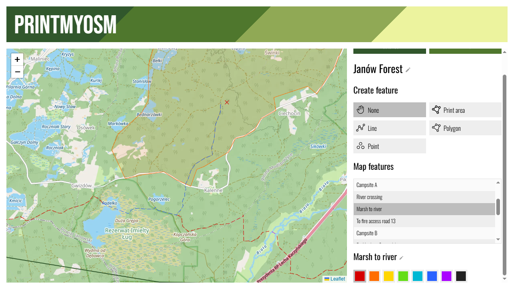
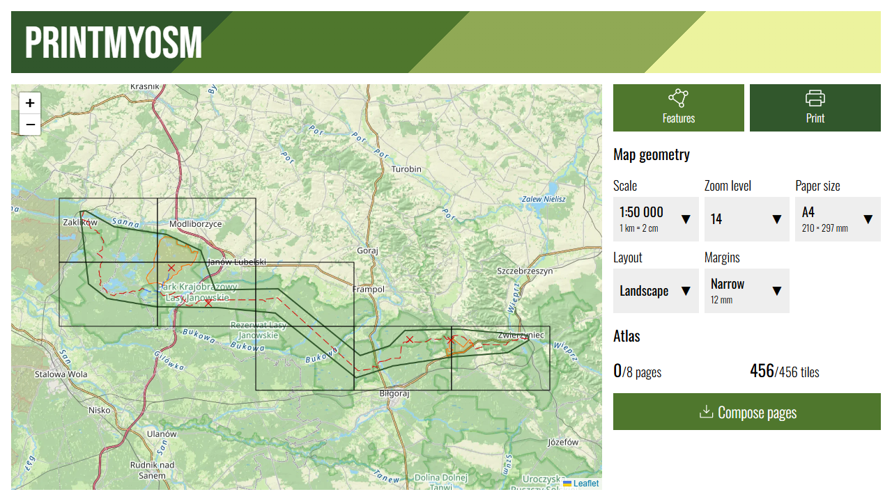

# PrintMyOSM

PrintMyOSM is a tool for printing hiking maps based on OpenStreetMap. Choose your destination, draw the features you need, adjust map geometry and print away!




## How to run

Make sure you've installed [node and npm](https://docs.npmjs.com/downloading-and-installing-node-js-and-npm). Navigate to the project's root directory and execute the following commands:

```
npm install
npm run printmyosm
```

This will build the web app and serve it at http://localhost:8080.

## PrintMyOSM is experimental software

PrintMyOSM is a proof-of-concept experimental app that is only suitable for personal use. For your own security, **you must not host PrintMyOSM on the public Internet**. Please keep the following in mind:

* Most OSM tile providers (including the default tile provider [Tracestrack](https://tracestrack.com/)) explicitly forbid downloading tiles en masse. Excessive traffic originating from your machine may get your IP address blocked.
* PrintMyOSM's API handlers implement **no validation or security measures**. An attacker could trivially deposit arbitrary data to your disk drive or crash your server.
* All downloaded tiles are cached indefinitely with no automatic cleanup routine. The `tiles` directory may take up an unbounded amount of disk space.
* Map and page data is shared among all users. One person can easily overwrite another person's work or interfere with their print job.
* Maps meant for web use are not always optimized for printing. For example, some features may only become visible at too high a zoom level, at which point they become too hard to read at the desired map scale.
